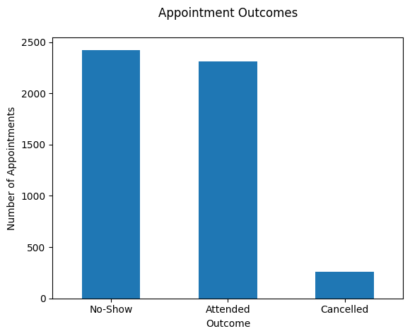
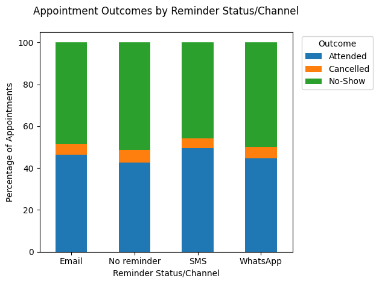
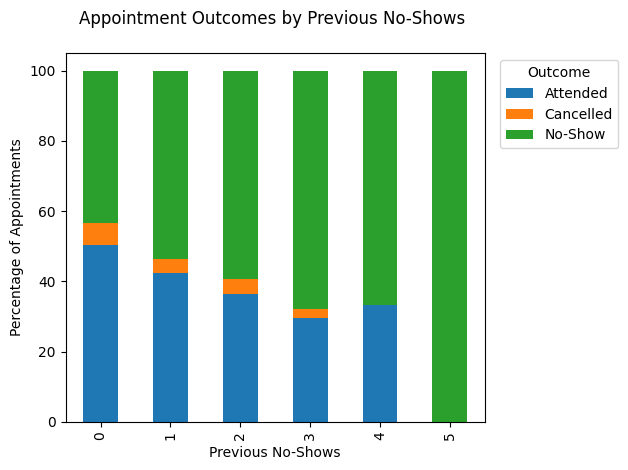
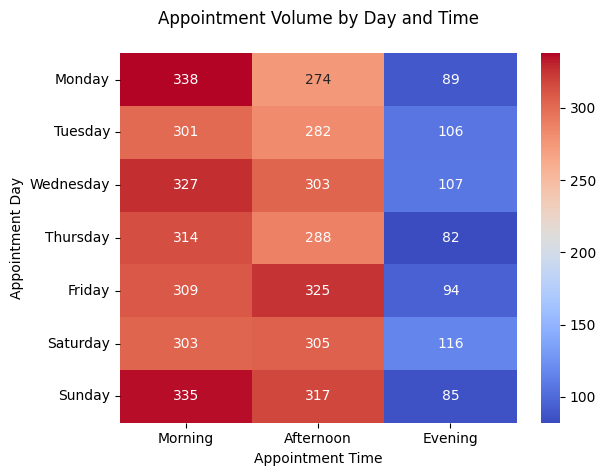

# HealthConnect Appointment Analysis

Exploratory data analysis of the HealthConnect appointment dataset, focused on understanding appointment attendance, identifying patterns associated with no-shows, and generating actionable business insights.

This project forms part of the **Data Analytics track at Analyst Lab Africa**, using Python to move from initial data assessment and analytical planning into exploratory analysis and insight generation.

---

## Project Objectives

The analysis focuses on understanding:

- Appointment attendance and no-show patterns.
- The relationship between previous no-show behaviour and current outcomes.
- Appointment attendance across reminder channels and appointments without reminders.
- Appointment demand across days and time periods.
- Waiting time and its relationship with appointment outcomes.
- Differences in outcomes across appointment types and patient characteristics.
- Potential operational opportunities for improving appointment attendance.

---

## Dataset

The HealthConnect dataset contains:

- **5,000 appointment records**
- **18 variables**
- Appointment, patient, reminder, scheduling, accessibility, and outcome information.

Key variables include:

| Category | Variables |
|---|---|
| Appointment | `appointment_id`, `appointment_type`, `appointment_date`, `appointment_day`, `appointment_time` |
| Patient | `patient_id`, `gender`, `age`, `age_group` |
| Booking History | `booking_date`, `booking_lead_days`, `previous_appointments`, `previous_no_shows` |
| Reminders | `reminder_sent`, `reminder_channel` |
| Accessibility | `distance_to_clinic_km`, `waiting_time_minutes` |
| Outcome | `appointment_outcome` |

The dataset is synthetic and anonymised.

---

## Analysis Process

The analysis was conducted using:

- **Python**
- **Pandas**
- **Matplotlib**
- **Seaborn**
- **Jupyter Notebook**

The workflow included:

1. Data validation and quality checks.
2. Data type preparation.
3. Missing-value investigation.
4. Exploratory data analysis.
5. KPI calculation.
6. Comparative analysis across relevant variables.
7. Visualisation and interpretation.
8. Business insight generation.
9. Recommendations and limitation assessment.

Missing `reminder_channel` values were interpreted as **"No reminder"**, based on the dataset's data dictionary.

---

## Key KPIs

| KPI | Description |
|---|---|
| **No-Show Rate** | Proportion of appointments resulting in a no-show. |
| **Reminder Effectiveness Rate** | Attendance rate across reminder statuses/channels. |
| **Reminder Non-send Rate** | Proportion of appointments that did not receive a reminder. |
| **Average Waiting Time** | Average recorded waiting time for appointments. |

---

## Key Findings

### 1. No-shows are a major attendance challenge

No-shows represent approximately **47.5%** of all appointments, making them the most common appointment outcome.

### 2. Previous no-shows are strongly associated with future no-shows

The no-show rate increases from approximately **43.5%** among patients with no previous no-shows to approximately **68.0%** among patients with three previous no-shows.

This suggests that previous attendance behaviour may be useful for identifying patients who require additional follow-up.

### 3. Reminder coverage has room for improvement

Approximately **27.3%** of appointments did not receive a recorded reminder.

Attendance proportions varied across reminder channels, with SMS showing the highest attendance proportion at approximately **50%**. However, the differences between channels were relatively small, so the analysis does not establish that one channel is substantially more effective than another.

### 4. Appointment demand is concentrated in the morning and afternoon

Most appointments occur during the morning and afternoon, while evening appointment volumes are considerably lower.

Daily appointment volumes are relatively similar, although **Monday morning** records the highest individual day-time appointment volume.

### 5. Several factors show limited differentiation

Waiting time, appointment type, and age group show relatively similar outcome distributions across their respective categories.

Distance to the clinic shows slightly higher median values for no-show and cancelled appointments, but the distributions overlap considerably.

---

## Selected Visualisations

### Appointment Outcomes



The distribution of attended, no-show, and cancelled appointments, highlighting the high proportion of no-show appointments.

### Appointment Outcomes by Reminder Status/Channel



Comparison of appointment outcomes across SMS, Email, WhatsApp, and appointments without a reminder.

### Appointment Outcomes by Previous No-Shows



Shows the increasing no-show proportion associated with higher previous no-show counts.

### Appointment Volume by Day and Time



Shows how appointment demand is distributed across days of the week and time periods.

---

## Business Recommendations

Based on the initial analysis:

- **Improve reminder coverage** by reducing the proportion of appointments without reminders.
- **Prioritise patients with previous no-shows** for targeted follow-up and additional confirmation.
- **Investigate reasons for repeated no-shows** through patient feedback or targeted surveys.
- **Align staffing and resources with appointment demand**, particularly during morning and afternoon periods.
- **Monitor attendance outcomes after interventions** to evaluate whether changes improve appointment attendance.
- Continue investigating distance-related patterns before considering remote consultation as an intervention.

These recommendations are based on observed associations in the dataset and should be validated with further analysis or real-world operational data.

---

## Limitations

- The dataset is **synthetic and anonymised**, so findings may not fully represent real-world patient behaviour.
- The analysis identifies associations but does not establish causal relationships.
- `distance_to_clinic_km` and `waiting_time_minutes` contain a small number of missing observations.
- Reminder data indicates the recorded reminder channel but does not establish whether a patient received, opened, or engaged with the reminder.
- The dataset does not contain potentially relevant context such as reasons for missed appointments, patient satisfaction, health status, or socioeconomic circumstances.

---

## Project Structure

```text
.
├── README.md
├── data
│   ├── HealthConnect_Appointment_Data.csv
│   └── HealthConnect_Data_Dictionary.xlsx
├── healthconnect_analysis.ipynb
└── summary_report.md
```