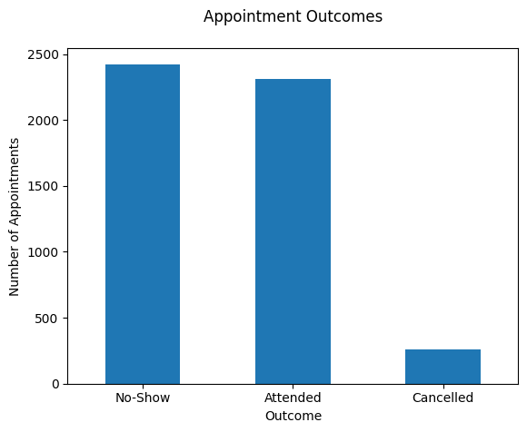
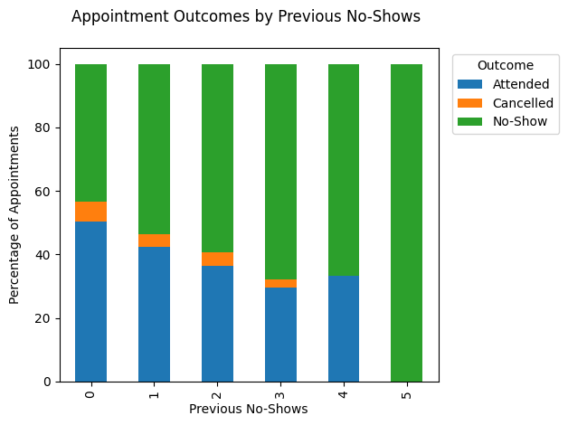
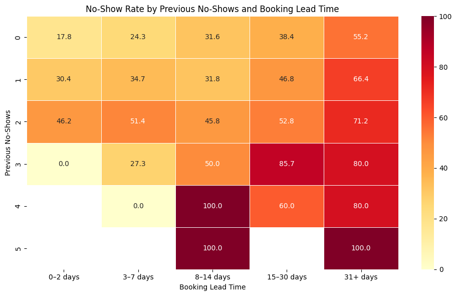
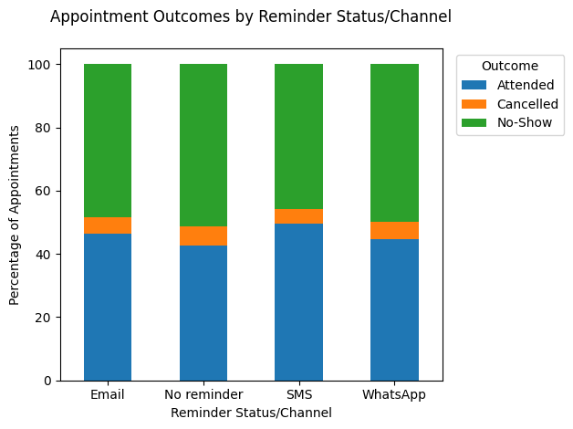
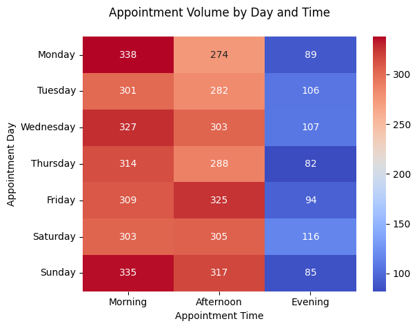
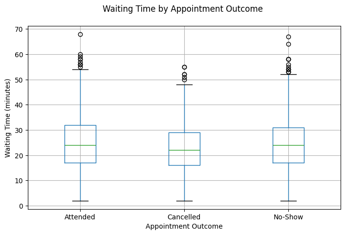

# HealthConnect Appointment Analysis

## Table of Contents

1. [Background and Overview](#1-background-and-overview)
2. [Data Structure Overview](#2-data-structure-overview)
3. [Executive Summary](#3-executive-summary)
4. [Methodology](#4-methodology)
5. [Key Performance Indicators](#5-key-performance-indicators)
6. [Insights Deep Dive](#6-insights-deep-dive)
7. [Cross-Track Collaboration](#7-cross-track-collaboration)
8. [Recommendations](#8-recommendations)
9. [Limitations](#9-limitations)
10. [Appendices](#10-appendices)

---

## 1. Background and Overview

HealthConnect is a synthetic/anonymised clinic appointment analysis project focused on understanding appointment attendance, no-show behaviour, reminder coverage, scheduling patterns, and operational opportunities.

The analysis uses appointment-level data to examine how different characteristics of the booking and appointment process relate to appointment outcomes. The project combines exploratory data analysis, statistical testing, advanced segmentation, Data Science modelling, and independent validation.

The primary appointment outcomes considered throughout the analysis are:

- **Attended**
- **No-Show**
- **Cancelled**

The analysis is designed to provide an evidence base for understanding appointment behaviour and identifying areas that may warrant further operational investigation.

The project does not treat observed relationships as causal. Where associations are identified, they are presented as patterns within the available dataset rather than proof that one factor directly causes another.

### Project Objectives

The analysis focuses on the following questions:

1. How does appointment attendance vary across reminder channels and appointments where no reminder was sent?
2. How is previous no-show behaviour associated with current appointment outcomes?
3. Which days of the week and time periods have the highest appointment volumes?
4. How is waiting time associated with appointment outcomes?
5. What proportion of appointments did not receive a reminder?
6. Does appointment type influence appointment outcomes?
7. How does booking lead time relate to no-show behaviour?
8. Which combinations of appointment characteristics show higher observed no-show rates?
9. Which analytical findings can provide useful inputs to the Data Science workflow?

### Project Scope

The project covers:

- Data validation and preparation
- Exploratory data analysis
- KPI development
- Appointment outcome analysis
- Booking lead-time analysis
- Previous no-show analysis
- Reminder coverage and effectiveness
- Higher-risk segment analysis
- Statistical validation
- Cross-track Data Analytics to Data Science contribution
- Independent quality assurance and retesting

Detailed analytical evidence and calculations are contained in the project notebooks, while this document provides the consolidated project narrative and final findings.

---

## 2. Data Structure Overview

The HealthConnect dataset contains **5,000 appointment records across 18 variables**.

The dataset is synthetic/anonymised and represents appointment activity within a clinic setting.

### Dataset Variables

| Variable | Description |
|---|---|
| `appointment_id` | Unique identifier for each appointment |
| `patient_id` | Patient identifier |
| `gender` | Patient gender |
| `age` | Patient age |
| `age_group` | Age category |
| `appointment_type` | Type of appointment |
| `booking_date` | Date the appointment was booked |
| `appointment_date` | Scheduled appointment date |
| `appointment_day` | Day of the week of the appointment |
| `appointment_time` | Scheduled appointment time |
| `booking_lead_days` | Number of days between booking and appointment |
| `previous_appointments` | Number of previous appointments |
| `previous_no_shows` | Number of previous no-shows |
| `reminder_sent` | Whether a reminder was sent |
| `reminder_channel` | Reminder channel used |
| `distance_to_clinic_km` | Distance from patient to clinic |
| `waiting_time_minutes` | Appointment waiting time |
| `appointment_outcome` | Appointment outcome: Attended, No-Show, or Cancelled |

### Data Quality and Preparation

Initial validation confirmed that the dataset contains unique appointment records and consistent categorical values.

`booking_date` and `appointment_date` were converted to datetime values to support date-based analysis and the calculation of booking lead time.

The dataset contains limited missing values in selected variables, particularly:

- `reminder_channel`
- `distance_to_clinic_km`
- `waiting_time_minutes`

According to the dataset documentation, missing values in `reminder_channel` represent appointments where no reminder was sent. These values were therefore recoded as **No reminder**.

This was treated as a documented category transformation rather than statistical imputation.


### Appointment Outcomes

The primary outcome variable is `appointment_outcome`, containing three categories:

- Attended
- No-Show
- Cancelled

The outcome variable is used throughout the analysis to compare appointment behaviour across booking, reminder, scheduling, and patient-history characteristics.

---

## 3. Executive Summary

HealthConnect's appointment data shows a substantial level of missed appointments, with an overall No-Show Rate of 48.46%. This makes appointment attendance an important operational area for further investigation.

Booking lead time showed a clear observed relationship with no-show behaviour. The no-show rate increased from 24.18% among appointments booked 0–2 days in advance to 60.49% among appointments booked 31 or more days in advance. A Chi-square test confirmed a statistically significant association between booking lead-time group and appointment outcome, although the effect size was modest.

Previous no-show behaviour also showed a statistically significant association with subsequent appointment outcomes. When combined with booking lead time, the analysis identified several larger appointment groups with elevated observed no-show rates. Notably, appointments booked 31+ days in advance showed elevated no-show rates even among patients with no previous no-shows, indicating that booking lead time provides additional information beyond previous attendance history.

Reminder coverage represents another area for operational attention. 27.32% of appointments had no recorded reminder. Within higher-risk segments, appointments without a recorded reminder had a 61.04% no-show rate compared with 55.25% for SMS reminders. These differences are observational and should not be interpreted as evidence that a particular reminder channel directly causes better attendance.

Overall, the analysis suggests that HealthConnect could benefit from improving reminder coverage, considering booking lead time and previous attendance behaviour when prioritising follow-up, monitoring repeated no-show behaviour, and aligning operational resources with observed appointment-demand patterns. These findings are based on synthetic/anonymised data and should be validated against production data before being used for operational decisions.

### Executive Summary KPIs

| KPI | Result |
|---|---|
| No-Show Rate | 48.46% |
| Reminder Non-send Rate | 27.32% |
| Reminder Effectiveness Rate | Varies by reminder status/channel |
| Average Waiting Time | Validated against analytical output |

The detailed evidence supporting these findings is presented in the sections that follow.

---

## 4. Methodology

The analysis was conducted using Python and Jupyter Notebook, with Pandas used for data preparation and analysis and Matplotlib and Seaborn used for visualisation.

The methodology followed a progression from data validation to exploratory analysis, deeper investigation, statistical testing, cross-track modelling, and independent validation.

### 4.1 Data Validation

The initial stage focused on establishing the structural quality of the dataset.

This included:

- Checking dataset dimensions
- Reviewing column names and data types
- Checking for duplicate records
- Checking appointment ID uniqueness
- Reviewing categorical values
- Identifying missing values
- Converting date fields to appropriate datetime types
- Verifying the interpretation of missing reminder-channel values

### 4.2 Exploratory Data Analysis

Exploratory analysis was used to understand the overall structure and behaviour of the appointment data.

The analysis examined:

- Appointment outcomes
- Appointment types
- Patient age groups
- Booking lead time
- Previous appointment history
- Previous no-shows
- Reminder coverage
- Reminder channels
- Appointment days
- Appointment times
- Waiting times
- Distance to clinic

The exploratory stage was used to identify patterns requiring deeper analysis rather than to make causal conclusions.

### 4.3 KPI Development

Four KPIs were selected to provide a concise view of appointment performance:

- No-Show Rate
- Reminder Effectiveness Rate
- Reminder Non-send Rate
- Average Waiting Time

The KPIs were calculated from the appointment-level data and subsequently independently reproduced during validation.

### 4.4 Booking Lead-Time Analysis

Booking lead time was analysed both as a continuous variable and through grouped intervals:

**Lead-Time Group**
- 0–2 days
- 3–7 days
- 8–14 days
- 15–30 days
- 31+ days

This grouping was used primarily for analytical communication and segmentation.

The analysis compared appointment outcomes across these groups and examined how booking lead time interacted with previous no-show behaviour.

### 4.5 Previous No-Show Analysis

Previous no-show behaviour was examined to determine whether historical attendance behaviour was associated with current appointment outcomes.

The analysis considered:

- Number of previous no-shows
- Current appointment outcome
- Previous no-show behaviour combined with booking lead time

This was later incorporated into the cross-track Data Science workflow through the derived `previous_no_show_rate` feature.

### 4.6 Reminder Analysis

Reminder behaviour was analysed across:

- Reminder sent versus no reminder
- SMS
- WhatsApp
- Email

The analysis considered both reminder coverage and observed appointment outcomes.

Reminder effectiveness was treated as an observational comparison rather than a causal measure.

### 4.7 Statistical Testing

Chi-square tests of independence were used to assess whether selected categorical variables were statistically associated with appointment outcomes.

Cramér's V was used alongside statistical significance to provide an indication of association strength.

The principal tests included:

- Booking Lead Time × Appointment Outcome
- Previous No-Shows × Appointment Outcome

This ensured that the analysis considered both statistical significance and practical effect size.

### 4.8 Cross-Track Data Science Contribution

Validated analytical findings were carried into the Data Science workflow to determine whether the identified behavioural patterns could provide useful predictive information.

The refined candidate feature set included:

- `booking_lead_days`
- `previous_no_show_rate`
- `is_new_patient`
- `reminder_sent`
- `reminder_channel`

The modelling process identified multicollinearity when multiple representations of previous appointment history were included simultaneously. The feature specification was subsequently refined to avoid redundant information.

The resulting candidate model achieved an ROC-AUC of approximately 0.69.

The model is treated as a risk-ranking and triage support tool rather than an automated decision-making system.

### 4.9 Independent Validation

A separate testing workflow was used to independently reproduce the main analytical outputs.

Validation covered:

- KPI calculations
- Analytical findings
- Statistical results
- Key visualisations
- Cross-track feature handoff
- Model feature specification
- Refinements made during the modelling process
- Retesting after refinement

This provided a final quality-assurance layer before the findings were consolidated into the project report.

---

## 5. Key Performance Indicators

The final analysis uses four primary KPIs to provide a concise view of appointment performance.

### 5.1 No-Show Rate

**No-Show Rate: 48.46%**

The No-Show Rate represents the proportion of all appointments that resulted in a no-show.

It provides the primary measure of missed appointment activity within the HealthConnect dataset.

A rate of 48.46% means that almost half of the recorded appointments did not result in attendance.

The KPI was independently recalculated during the validation process and reproduced the original analytical result.

### 5.2 Reminder Effectiveness Rate

Reminder effectiveness is assessed through observed attendance rates across reminder statuses and channels.

For the overall dataset:

| Reminder Channel | Attended | Total | Attendance Rate |
|---|---|---|---|
| Email | 248 | 533 | 46.53% |
| No reminder | 583 | 1,366 | 42.68% |
| SMS | 992 | 2,000 | 49.60% |
| WhatsApp | 491 | 1,101 | 44.60% |

The results show differences in observed attendance across reminder groups.

These figures should be interpreted as descriptive comparisons. They do not establish that a specific reminder channel causes higher attendance because channel assignment may be related to other characteristics of the appointment or patient.

### 5.3 Reminder Non-send Rate

**Reminder Non-send Rate: 27.32%**

The Reminder Non-send Rate represents the proportion of appointments where no reminder was recorded.

Based on the dataset:

- No reminder = 1,366 appointments
- Total appointments = 5,000

Therefore:

**Reminder Non-send Rate = 27.32%**

This KPI is operationally relevant because reminder coverage represents an identifiable process condition within the appointment workflow.

The value was independently recalculated during validation and reproduced the original result.

### 5.4 Average Waiting Time

Average waiting time measures the mean recorded waiting time for appointments with available waiting-time data.

The KPI was independently recalculated during the validation process and reproduced the analytical result.

Waiting time was also examined by appointment outcome. The resulting distributions showed substantial overlap between attended, cancelled, and no-show appointments, limiting the strength of waiting time as a standalone differentiator within this dataset.

### KPI Summary

| KPI | Result | Interpretation |
|---|---|---|
| No-Show Rate | 48.46% | Nearly half of appointments resulted in a no-show |
| Reminder Effectiveness Rate | Channel-dependent | Attendance varied across reminder groups |
| Reminder Non-send Rate | 27.32% | More than one-quarter of appointments had no recorded reminder |
| Average Waiting Time | Validated | Provides an operational measure of appointment waiting experience |

All four KPIs were independently reproduced during the project's validation process.

---

## 6. Insights Deep Dive

This section presents the main analytical findings from the HealthConnect dataset. The analysis moves from overall appointment outcomes to booking behaviour, previous attendance history, reminder activity, appointment demand, and other operational characteristics.

The findings describe observed patterns within the dataset. They should not be interpreted as causal relationships.

### 6.1 Appointment Attendance

The overall appointment outcome distribution provides the starting point for understanding HealthConnect's attendance behaviour.

The **No-Show Rate was 48.46%**, meaning that almost half of the recorded appointments did not result in attendance.



*The distribution of attended, no-show, and cancelled appointments, highlighting the high proportion of no-show appointments.*

This makes missed appointments a substantial component of the appointment outcome distribution and provides the basis for investigating the characteristics associated with no-show behaviour.

The analysis therefore examined booking lead time, previous no-show behaviour, reminder activity, appointment timing, waiting time, and other appointment characteristics to identify patterns that may help explain differences in observed outcomes.

### 6.2 Booking Lead Time

Booking lead time showed a clear pattern in the observed no-show rates.

| Booking Lead Time | No-Show Rate |
|---|---:|
| 0–2 days | 24.18% |
| 3–7 days | 30.05% |
| 8–14 days | 33.55% |
| 15–30 days | 43.21% |
| 31+ days | 60.49% |

The no-show rate increased consistently as the time between booking and the scheduled appointment became longer.

Appointments booked 31 or more days in advance had an observed no-show rate of **60.49%**, compared with **24.18%** for appointments booked within 0–2 days.

A Chi-square test found a statistically significant association between booking lead-time group and appointment outcome:

| Statistic | Result |
|---|---:|
| χ² | 341.12 |
| Degrees of freedom | 8 |
| p-value | <0.001 |
| Cramér's V | 0.185 |

The Cramér's V value indicates a **modest association**.

The pattern suggests that booking lead time provides useful information when examining appointment attendance. However, the analysis does not establish that longer booking lead times directly cause patients to miss appointments.

### 6.3 Previous No-Show Behaviour

Previous no-show behaviour was examined to determine whether a patient's attendance history was associated with the outcome of their current appointment.



*Appointment outcomes across groups with different numbers of previous no-shows.*

The analysis found a statistically significant association between previous no-shows and current appointment outcomes:

| Statistic | Result |
|---|---:|
| χ² | 83.38 |
| Degrees of freedom | 10 |
| p-value | <0.001 |
| Cramér's V | 0.091 |

The relatively small Cramér's V indicates that the association is weaker than the relationship observed for booking lead time.

Nevertheless, previous no-show behaviour provides useful context when considered alongside other appointment characteristics.

In particular, patients with previous no-shows were more frequently represented within appointment groups showing elevated current no-show rates.

This finding supports the use of attendance history as an analytical feature rather than treating every appointment as independent of previous behaviour.

### 6.4 Combined Behavioural Patterns

Booking lead time and previous no-show behaviour were examined together to identify combinations associated with higher observed no-show rates.



*Observed no-show rates across combinations of previous no-show history and booking lead time.*

Several larger segments showed particularly high rates:

| Previous No-Shows | Booking Lead Time | Appointments | No-Show Rate |
|---:|---|---:|---:|
| 2 | 31+ days | 191 | 71.20% |
| 1 | 31+ days | 782 | 66.37% |
| 0 | 31+ days | 1,410 | 55.18% |
| 2 | 15–30 days | 125 | 52.80% |
| 1 | 15–30 days | 419 | 46.78% |

The combination of previous no-show behaviour and longer booking lead time produced higher observed no-show rates than shorter booking lead-time groups.

An important observation is that the **0 previous no-shows + 31+ days** group still had a 55.18% no-show rate.

This suggests that longer booking lead time provides information beyond previous attendance history alone.

The higher-order previous no-show groups should be interpreted more cautiously because some contain relatively small numbers of appointments and therefore show greater variability.

For this reason, the analysis uses larger segments when identifying practical patterns rather than relying on isolated 100% or near-100% cells from small groups.

### 6.5 Reminder Coverage

Reminder coverage was examined to determine how frequently appointments had a recorded reminder and whether reminder coverage varied across booking lead-time groups.

Overall, **27.32% of appointments had no recorded reminder**.

| Booking Lead Time | No Reminder |
|---|---:|
| 0–2 days | 28.28% |
| 3–7 days | 24.75% |
| 8–14 days | 26.74% |
| 15–30 days | 28.36% |
| 31+ days | 27.22% |

Reminder non-send rates remained relatively close across all booking lead-time groups, ranging from **24.75% to 28.36%**.

This suggests that the increase in no-show rates across longer booking lead times is not primarily explained by a corresponding reduction in reminder coverage.

Reminder coverage therefore represents a separate operational consideration rather than simply being a proxy for booking lead time.

### 6.6 Reminder Effectiveness

Reminder outcomes were first examined across the overall dataset.



*Comparison of appointment outcomes across SMS, Email, WhatsApp, and appointments without a reminder.*

| Reminder Channel | Attended | Total | Attendance Rate |
|---|---:|---:|---:|
| Email | 248 | 533 | 46.53% |
| No reminder | 583 | 1,366 | 42.68% |
| SMS | 992 | 2,000 | 49.60% |
| WhatsApp | 491 | 1,101 | 44.60% |

SMS had the highest observed attendance rate among the recorded reminder channels, while appointments with no recorded reminder had the lowest attendance rate.

The analysis was then narrowed to the larger higher-risk segments identified from booking lead time and previous no-show behaviour.

| Reminder Channel | Appointments | Attendance Rate | No-Show Rate |
|---|---:|---:|---:|
| SMS | 1,133 | 39.98% | 55.25% |
| WhatsApp | 674 | 35.91% | 58.30% |
| No reminder | 811 | 33.42% | 61.04% |
| Email | 309 | 37.86% | 58.58% |

Within this higher-risk subset, appointments without a recorded reminder had the highest observed no-show rate at **61.04%**, while SMS had the lowest at **55.25%**.

The differences between reminder channels are relatively modest, and the data is observational.

Therefore, the analysis does **not** conclude that SMS causes better attendance or that one channel is inherently more effective. Differences may reflect the characteristics of patients receiving each channel, appointment mix, timing, or other factors not controlled for in the analysis.

The practical finding is instead that reminder coverage is incomplete and that reminder activity contains potentially useful information for further testing and monitoring.

### 6.7 Appointment Demand

Appointment demand was examined across days of the week and time periods to identify scheduling patterns.



*Appointment demand across days of the week and time periods.*

Demand was concentrated primarily in the **morning and afternoon periods**, with **Monday morning** representing the highest-volume day/time combination.

This pattern provides useful operational context for resource planning.

Higher appointment volumes during particular periods may require closer alignment between appointment scheduling, staffing levels, and clinic capacity.

The analysis does not by itself determine whether staffing was insufficient during these periods. It identifies where appointment demand was concentrated and therefore where operational capacity could be examined further.

### 6.8 Waiting Time and Other Characteristics

Waiting time was examined across appointment outcomes to determine whether attended, cancelled, and no-show appointments showed clearly different waiting-time distributions.



*Waiting-time distributions across appointment outcomes.*

The distributions showed substantial overlap across the outcome groups.

This limits the strength of waiting time as a standalone differentiator of appointment outcomes.

Appointment type and age-group distributions were also broadly similar across outcomes, suggesting no strong separation based on these characteristics within the dataset.

Distance to the clinic showed some differences in median values between outcomes, but the distributions also overlapped considerably.

These variables therefore provide useful descriptive context but do not provide sufficiently strong evidence, on their own, to explain appointment attendance behaviour.

The broader pattern from the analysis is that booking behaviour, previous attendance history, and reminder activity provide more useful signals for deeper investigation than relying on a single demographic or operational variable.

---

## 7. Cross-Track Collaboration

The Data Analytics work also contributed directly to the Data Science workflow by identifying validated behavioural patterns that could be translated into predictive features.

### 7.1 Data Analytics → Data Science

The analytical findings highlighted several variables with potential predictive value:

- Booking lead time
- Previous appointment behaviour
- Previous no-show behaviour
- Reminder status
- Reminder channel
- New versus returning patient status

Rather than transferring every analytical feature directly into the model, the modelling process evaluated how these variables should be represented and whether they provided distinct information.

This resulted in a refined candidate feature set.

### 7.2 Feature Handoff

The refined candidate model used:

```text
booking_lead_days
previous_no_show_rate
is_new_patient
reminder_sent
reminder_channel
```

`previous_no_show_rate` was used instead of including multiple raw historical count variables simultaneously.

This avoided representing the same historical behaviour through highly related features.

The booking lead-time groups used during analytical reporting were retained as a communication and segmentation tool, while the continuous `booking_lead_days` variable was used for modelling.

### 7.3 Modelling Validation

The initial modelling workflow identified multicollinearity when:

- `previous_appointments`
- `previous_no_shows`
- `previous_no_show_rate`

were included together.

Because `previous_no_show_rate` is derived from historical appointment and no-show counts, including all three variables introduced redundant information.

The refined model retained the rate-based representation and removed the redundant raw count combination.

The resulting candidate model achieved an ROC-AUC of approximately 0.69.

The model therefore demonstrated useful predictive signal, but not a level of performance that would justify treating it as an autonomous decision-making system.

The model is better positioned as a risk-ranking and triage support tool that can help prioritise attention while keeping human review in the process.

### 7.4 Refinements

Several modelling refinements were evaluated during cross-track validation.

**Multicollinearity**

The previous no-show features were reviewed because they represented closely related information.

The feature specification was refined to avoid redundant historical representations.

**Booking Lead-Time Representation**

The grouped booking lead-time feature was compared with the continuous `booking_lead_days` variable.

The grouped representation added negligible predictive information once the continuous variable was included.

The grouped version was therefore retained primarily for analytical communication and segmentation, while the continuous feature was used in the candidate model.

**Interaction Term**

An interaction between previous no-show rate and booking lead time was also evaluated.

The interaction produced only a small change in model performance and predicted risk in the highest-risk segment by less than one percentage point.

The additional complexity was therefore not considered sufficiently useful to justify retaining the interaction in the final candidate specification.

**Reminder Features**

Reminder-related features provided statistically significant additional predictive information beyond booking lead time and previous attendance history.

A likelihood-ratio comparison produced:

- Likelihood ratio = 11.53
- Degrees of freedom = 3
- p-value = 0.0092

This indicates additional predictive information in the reminder variables.

It does not establish that reminders cause attendance to increase.

---

## 8. Recommendations

The findings support several areas for operational consideration.

### 8.1 Improve Reminder Coverage

With 27.32% of appointments having no recorded reminder, HealthConnect should investigate the process responsible for reminder assignment and identify why some appointments do not receive a reminder.

The objective should be to improve consistency of reminder coverage rather than immediately assuming that one channel is superior.

### 8.2 Use Booking Behaviour to Prioritise Follow-up

Longer booking lead times were consistently associated with higher observed no-show rates.

HealthConnect could therefore consider booking lead time as one factor when prioritising appointment follow-up or reminder monitoring.

This should be combined with other relevant information rather than used as a standalone rule.

### 8.3 Consider Previous Attendance Behaviour

Previous no-show history provides additional context when reviewing upcoming appointments.

Patients with repeated previous no-shows may warrant appropriate follow-up or engagement processes, particularly when combined with longer booking lead times.

### 8.4 Investigate Repeated No-Show Behaviour

Repeated no-shows represent a potentially important operational pattern.

Rather than treating repeated missed appointments simply as individual events, HealthConnect could investigate whether there are recurring barriers or process issues associated with these patients.

### 8.5 Align Resources With Appointment Demand

Appointment demand was concentrated during particular days and time periods, particularly Monday mornings and broader morning/afternoon periods.

Staffing and clinic resource planning could therefore be reviewed against observed appointment volumes.

### 8.6 Monitor Outcomes Over Time

Reminder coverage, attendance, cancellations, and no-show rates should be monitored continuously.

This would allow HealthConnect to determine whether operational changes are associated with measurable changes in appointment outcomes.

### 8.7 Explore Virtual-Care Options

Assess whether selected appointment types can be delivered virtually where clinically appropriate, particularly where this could reduce unnecessary travel or improve appointment accessibility.
---

## 9. Limitations

The findings should be interpreted within the following limitations.

**Synthetic Dataset**

The HealthConnect dataset is synthetic/anonymised and does not represent production clinical data.

The findings are therefore useful for demonstrating analytical methodology and identifying hypothetical operational opportunities, but they should not be treated as evidence of actual patient behaviour.

**Observational Relationships**

The analysis identifies associations rather than causal relationships.

For example, the lower observed no-show rate among appointments with reminders does not prove that sending a reminder directly reduces no-shows.

**Reminder Channel Differences**

Patients may not be randomly assigned to reminder channels.

Differences in attendance across SMS, WhatsApp, and Email may therefore reflect other characteristics of the patients or appointments.

**Small Segment Sizes**

Some combinations involving higher numbers of previous no-shows contain relatively small numbers of appointments.

High percentages in these cells should therefore be interpreted cautiously.

**Missing Values**

Selected variables contain missing values, particularly distance to clinic and waiting time.

These variables were handled according to the requirements of the relevant analyses, but missingness remains a limitation when interpreting those results.

**Predictive Model Limitations**

The candidate Data Science model provides predictive signal but should not be treated as a definitive predictor of individual patient behaviour.

It should support human review and prioritisation rather than automate decisions.

**Production Validation**

The findings and proposed solutions should be validated against real HealthConnect operational data before being implemented in a production environment.

---

## 10. Appendices

### Appendix A — Statistical Tests

The main statistical tests used in the project are summarised below.

| Relationship | Test | χ² | df | p-value | Cramér's V |
|---|---|---:|---:|---|---:|
| Booking Lead Time × Appointment Outcome | Chi-square test of independence | 341.12 | 8 | <0.001 | 0.185 |
| Previous No-Shows × Appointment Outcome | Chi-square test of independence | 83.38 | 10 | <0.001 | 0.091 |

Both relationships were statistically significant.

The effect sizes indicate that the associations should be interpreted as meaningful analytical signals rather than strong deterministic relationships.

### Appendix B — Validation Results

The independent validation workflow reproduced the project's primary KPIs and analytical findings.

| Validation Area | Result |
|---|---|
| No-Show Rate | Reproduced |
| Reminder Non-send Rate | Reproduced |
| Reminder Effectiveness | Reproduced |
| Average Waiting Time | Reproduced |
| Booking Lead-Time Findings | Reproduced |
| Previous No-Show Findings | Reproduced |
| Higher-Risk Segment Findings | Reproduced |
| Key Visualisations | Validated |
| Statistical Tests | Validated |
| Data Analytics → Data Science Handoff | Validated |
| Model Feature Specification | Refined |
| Retesting After Refinement | Passed |

The validation process identified a substantive modelling issue involving multicollinearity among previous appointment-history features.

The candidate feature specification was subsequently refined and retested.

### Appendix C — Additional Visualisations

The project notebooks contain additional visualisations supporting the main findings, including:

- Appointment outcome distributions
- Booking lead-time distributions
- No-show rate by booking lead time
- No-show rate by previous no-shows
- No-show rate by previous no-shows and booking lead time
- Reminder coverage by booking lead-time group
- Reminder effectiveness by reminder channel
- Appointment volume by day
- Appointment volume by time period
- Waiting-time distributions by appointment outcome
- Appointment type comparisons
- Age-group comparisons
- Distance-to-clinic comparisons

These visualisations provide supporting evidence for the findings presented in the main report.

### Appendix D — Project Structure and Technical Notes
```text
HealthConnect/
│
├── data/
│ └── healthconnect_appointments.csv
│
├── notebooks/
│ ├── healthconnect_eda.ipynb
│ ├── healthconnect_advanced_analysis.ipynb
│ └── healthconnect_testing.ipynb
│
└── README.md
```


**`healthconnect_eda.ipynb`**

Contains the main exploratory analysis, data preparation, KPI calculations, appointment outcome analysis, and core visualisations.

**`healthconnect_advanced_analysis.ipynb`**

Contains the deeper analysis of booking lead time, previous no-show behaviour, combined behavioural patterns, reminder coverage, reminder effectiveness, and statistical validation.

**`healthconnect_testing.ipynb`**

Contains the independent validation and quality-assurance workflow, including KPI reproduction, analytical finding validation, visualisation checks, cross-track validation, model refinements, and retesting.

**`data/`**

Contains the source HealthConnect appointment dataset used throughout the analysis.